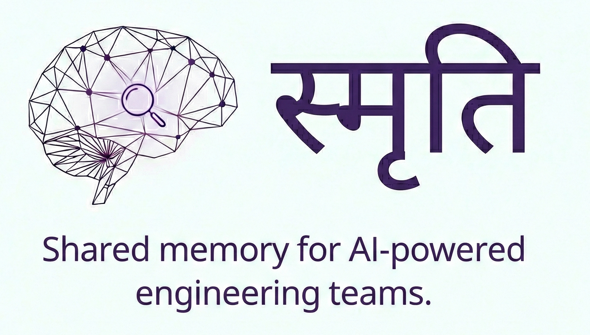

<p align="center">
  
</p>

Built on top of [QMD](https://github.com/tobi/qmd) by Tobi Lütke.

---

## The Problem

Your team ships code with AI agents every day — Claude Code, Cursor, Codex. But
every agent has a blind spot:

> **They don't remember anything.** Not from yesterday. Not from each other. Not
> from your teammates.

Here's what that looks like:

| Monday                                                        | Tuesday                                             |
| ------------------------------------------------------------- | --------------------------------------------------- |
| Your teammate spends 3 hours with Claude on an auth migration | You open a fresh session and ask the same questions |
| Claude figures out the right approach, makes key decisions    | Your Claude has no idea any of that happened        |
| Architectural insights, debugging breakthroughs, trade-offs   | All of it — gone                                    |

The result:

- **Duplicated work** — same questions asked across the team, different answers
  every time
- **Lost decisions** — "why did we do it this way?" lives in someone's closed
  chat window
- **Zero continuity** — each session starts from scratch, no matter how much
  your team has already figured out

The agents are brilliant. But they're amnesic. **This is the biggest gap in
AI-assisted development today.**

## What Smriti Does

**Smriti** (Sanskrit: _memory_) is a shared memory layer that sits underneath
all your AI agents.

Every conversation &rarr; automatically captured &rarr; indexed &rarr;
searchable. One command to recall what matters.

```bash
# What did we figure out about the auth migration?
smriti recall "auth migration approach"

# What has the team been working on?
smriti list --project myapp

# Search across every conversation, every agent, every teammate
smriti search "rate limiting strategy" --project api-service
```

> **20,000 tokens** of past conversations &rarr; **500 tokens** of relevant
> context. Your agents get what they need without blowing up your token budget.

## The Workflow

Here's what changes when your team runs Smriti:

**1. Conversations are captured automatically**

A lightweight hook saves every Claude Code session in the background. No manual
step, no copy-pasting. Your team's collective knowledge accumulates silently as
everyone works.

**2. Context flows between sessions**

Starting a new coding session? Pull in what's relevant:

```bash
smriti recall "how did we handle database connection pooling" --synthesize
```

Smriti searches across full-text and semantic indexes, deduplicates by session,
and optionally synthesizes the results into a single coherent summary via a
local LLM. Your new session starts with the full picture, not a blank slate.

**3. Knowledge stays organized**

Sessions are automatically tagged by project, agent, and category. Search by
what matters:

```bash
# Everything about deployment across all agents
smriti search "deployment" --category decision

# What has Cursor been used for on this project?
smriti list --agent cursor --project frontend

# All architectural decisions, team-wide
smriti search "architecture" --category decision
```

**4. Teams share context through git**

Export knowledge to a `.smriti/` directory in your project repo. Commit it. Your
teammates pull it and import it into their local memory. No cloud service, no
account, no sync infrastructure — just git.

```bash
# Share what you've learned
smriti share --project myapp --category decision

# Pull in what others have shared
smriti sync --project myapp
```

## Install

**macOS / Linux:**

```bash
curl -fsSL https://raw.githubusercontent.com/zero8dotdev/smriti/main/install.sh | bash
```

**Windows** (PowerShell):

```powershell
irm https://raw.githubusercontent.com/zero8dotdev/smriti/main/install.ps1 | iex
```

Both installers will:

- Install [Bun](https://bun.sh) if you don't have it
- Clone Smriti to `~/.smriti`
- Set up the `smriti` CLI on your PATH
- Configure the Claude Code auto-save hook

### Requirements

- **macOS, Linux, or Windows 10+**
- **Git**
- **Bun** >= 1.1 (installed automatically)
- **Ollama** (optional — for local summarization and synthesis)

### Upgrade

```bash
smriti upgrade
```

Pulls the latest version from GitHub and reinstalls dependencies. Equivalent to
re-running the install script.

## Commands

```bash
# Ingest conversations from your AI agents
smriti ingest claude          # Claude Code sessions
smriti ingest codex           # Codex CLI sessions
smriti ingest cline           # Cline CLI sessions
smriti ingest copilot         # GitHub Copilot (VS Code) sessions
smriti ingest cursor --project-path ./myapp
smriti ingest file transcript.txt --title "Planning Session"
smriti ingest all             # All known agents at once

# Search and recall
smriti search "query"         # Full-text + vector hybrid search
smriti recall "query"         # Smart recall with session deduplication
smriti recall "query" --synthesize  # Synthesize into one coherent summary

# Filter anything by project, agent, or category
smriti search "auth" --project myapp --agent claude-code
smriti list --category decision --project api

# Manage your memory
smriti status                 # Statistics across all agents
smriti list                   # Recent sessions
smriti show <session-id>      # Read a full session
smriti embed                  # Build vector embeddings for semantic search
smriti categorize             # Auto-categorize sessions
smriti projects               # List all tracked projects
smriti upgrade                # Update smriti to the latest version

# Context and comparison
smriti context                # Generate project context for .smriti/CLAUDE.md
smriti context --dry-run      # Preview without writing
smriti compare --last         # Compare last 2 sessions (tokens, tools, files)
smriti compare <id-a> <id-b>  # Compare specific sessions

# Team sharing
smriti share --project myapp  # Export to .smriti/ for git
smriti sync                   # Import teammates' shared knowledge
smriti team                   # View team contributions
```

## How It Works

```
Claude Code    Cursor    Codex    Other Agents
     |           |         |          |
     v           v         v          v
┌──────────────────────────────────────────┐
│          Smriti Ingestion Layer           │
│   (auto-hook + manual ingest commands)   │
└──────────────────┬───────────────────────┘
                   │
                   v
┌──────────────────────────────────────────┐
│         Local SQLite Database             │
│                                          │
│  memory_sessions    memory_messages      │
│  memory_fts (BM25)  content_vectors      │
│  project metadata   category tags        │
└──────────────────┬───────────────────────┘
                   │
          ┌────────┴────────┐
          v                 v
   Full-Text Search    Vector Search
   (BM25 + porter)     (embeddings + RRF)
          │                 │
          └────────┬────────┘
                   v
         Recall + Synthesis
         (optional, via Ollama)
```

Everything runs locally. Your conversations never leave your machine. The SQLite
database, the embeddings, the search indexes — all on disk, all yours.

## Tagging & Categories

Sessions and messages are automatically tagged into a hierarchical category
tree. Tags flow through every command — search, recall, list, and share — so you
can slice your team's knowledge by topic.

### Default Category Tree

Smriti ships with 7 top-level categories and 21 subcategories:

| Category       | Subcategories                                                           |
| -------------- | ----------------------------------------------------------------------- |
| `code`         | `code/implementation`, `code/pattern`, `code/review`, `code/snippet`    |
| `architecture` | `architecture/design`, `architecture/decision`, `architecture/tradeoff` |
| `bug`          | `bug/report`, `bug/fix`, `bug/investigation`                            |
| `feature`      | `feature/requirement`, `feature/design`, `feature/implementation`       |
| `project`      | `project/setup`, `project/config`, `project/dependency`                 |
| `decision`     | `decision/technical`, `decision/process`, `decision/tooling`            |
| `topic`        | `topic/learning`, `topic/explanation`, `topic/comparison`               |

### Auto-Classification

Smriti uses a two-stage pipeline to classify messages:

1. **Rule-based** — 24 keyword patterns with weighted confidence scoring. Each
   pattern targets a specific subcategory (e.g., words like "crash",
   "stacktrace", "panic" map to `bug/report`). Confidence is calculated from
   keyword density and rule weight.
2. **LLM fallback** — When rule confidence falls below the threshold (default
   `0.5`, configurable via `SMRITI_CLASSIFY_THRESHOLD`), Ollama classifies the
   message. Only activated when you pass `--llm`.

The most frequent category across a session's messages becomes the session-level
tag.

```bash
# Auto-categorize all uncategorized sessions (rule-based)
smriti categorize

# Include LLM fallback for ambiguous sessions
smriti categorize --llm

# Categorize a specific session
smriti categorize --session <session-id>
```

### Manual Tagging

Override or supplement auto-classification with manual tags:

```bash
smriti tag <session-id> <category>

# Examples
smriti tag abc123 decision/technical
smriti tag abc123 bug/fix
```

Manual tags are stored with confidence `1.0` and source `"manual"`.

### Custom Categories

Add your own categories to extend the default tree:

```bash
# List the full category tree
smriti categories

# Add a top-level category
smriti categories add ops --name "Operations"

# Add a nested category under an existing parent
smriti categories add ops/incident --name "Incident Response" --parent ops

# Include a description
smriti categories add ops/runbook --name "Runbooks" --parent ops --description "Operational runbook sessions"
```

### How Tags Filter Commands

The `--category` flag works across search, recall, list, and share:

| Command         | Effect of `--category`                                                          |
| --------------- | ------------------------------------------------------------------------------- |
| `smriti list`   | Shows categories column; filters sessions to matching category                  |
| `smriti search` | Filters full-text search results to matching category                           |
| `smriti recall` | Filters recall context; works with `--synthesize`                               |
| `smriti share`  | Controls which sessions are exported; files organized into `.smriti/knowledge/` |
| `smriti status` | Shows session count per category (no filter flag — always shows all)            |

**Hierarchical filtering** — Filtering by a parent category automatically
includes all its children. `--category decision` matches `decision/technical`,
`decision/process`, and `decision/tooling`.

### Categories in Share & Sync

**Categories survive the share/sync roundtrip exactly.** What gets serialized
during `smriti share` is exactly what gets deserialized during `smriti sync` —
the same category ID goes in, the same category ID comes out. No
reclassification, no transformation, no loss. The category a session was tagged
with on one machine is the category it will be indexed under on every other
machine that syncs it.

When you share sessions, the category is embedded in YAML frontmatter inside
each exported markdown file:

```yaml
---
id: 2e5f420a-e376-4ad4-8b35-ad94838cbc42
category: project
project: smriti
agent: claude-code
author: zero8
shared_at: 2026-02-10T11:29:44.501Z
tags: ["project", "project/dependency"]
---
```

When a teammate runs `smriti sync`, the frontmatter is parsed and the category
is restored into their local `smriti_session_tags` table — indexed as `project`,
searchable as `project`, filterable as `project`. The serialization and
deserialization are symmetric: `share` writes `category: project` → `sync` reads
`category: project` → `tagSession(db, sessionId, "project", 1.0, "team")`. No
intermediate step reinterprets the value.

Files are organized into subdirectories by primary category (e.g.,
`.smriti/knowledge/project/`, `.smriti/knowledge/decision/`), but sync reads the
category from frontmatter, not the directory path.

> **Note:** Currently only the primary `category` field is restored on sync.
> Secondary tags in the `tags` array are serialized in the frontmatter but not
> yet imported. If a session had multiple tags (e.g., `project` +
> `decision/tooling`), only the primary tag survives the roundtrip.

```bash
# Share decisions — category metadata travels with the files
smriti share --project myapp --category decision

# Teammate syncs — categories restored exactly from frontmatter
smriti sync --project myapp
```

### Examples

```bash
# All architectural decisions
smriti search "database" --category architecture

# Recall only bug-related context
smriti recall "connection timeout" --category bug --synthesize

# List feature sessions for a specific project
smriti list --category feature --project myapp

# Share only decision sessions
smriti share --project myapp --category decision
```

## Context: Token Reduction (North Star)

Every new Claude Code session starts from zero — no awareness of what happened
yesterday, which files were touched, what decisions were made. `smriti context`
generates a compact project summary (~200-300 tokens) and injects it into
`.smriti/CLAUDE.md`, which Claude Code auto-discovers.

```bash
smriti context                    # auto-detect project, write .smriti/CLAUDE.md
smriti context --dry-run          # preview without writing
smriti context --project myapp    # explicit project
smriti context --days 14          # 14-day lookback (default: 7)
```

The output looks like this:

```markdown
## Project Context

> Auto-generated by `smriti context` on 2026-02-11. Do not edit manually.

### Recent Sessions (last 7 days)

- **2h ago** Enriched ingestion pipeline (12 turns) [code]
- **1d ago** Search & recall pipeline (8 turns) [feature]

### Hot Files

`src/db.ts` (14 ops), `src/ingest/claude.ts` (11 ops), `src/search/index.ts` (8
ops)

### Git Activity

- commit `main`: "Fix auth token refresh" (2026-02-10)

### Usage

5 sessions, 48 turns, ~125K input / ~35K output tokens
```

No Ollama, no network calls, no model loading. Pure SQL queries against sidecar
tables, rendered as markdown. Runs in < 100ms.

### Measuring the Impact

Does this actually save tokens? Honestly — we don't know yet. We built the tools
to measure it, ran A/B tests, and the results so far are... humbling. Claude is
annoyingly good at finding the right files even without help.

But this is the north star, not the destination. We believe context injection
will matter most on large codebases without detailed docs, ambiguous tasks that
require exploration, and multi-session continuity. We just need the data to
prove it (or disprove it and try something else).

So we're shipping the measurement tools and asking you to help. Run A/B tests on
your projects, paste the results in
[Issue #13](https://github.com/zero8dotdev/smriti/issues/13), and let's figure
this out together.

#### A/B Testing Guide

```bash
# Step 1: Baseline session (no context)
mv .smriti/CLAUDE.md .smriti/CLAUDE.md.bak
# Start a Claude Code session, give it a task, let it finish, exit

# Step 2: Context session
mv .smriti/CLAUDE.md.bak .smriti/CLAUDE.md
smriti context
# Start a new session, give the EXACT same task, let it finish, exit

# Step 3: Ingest and compare
smriti ingest claude
smriti compare --last --project myapp
```

#### Compare Command

```bash
smriti compare <session-a> <session-b>   # by session ID (supports partial IDs)
smriti compare --last                    # last 2 sessions for current project
smriti compare --last --project myapp    # last 2 sessions for specific project
smriti compare --last --json             # machine-readable output
```

Output:

```
Session A: Fix auth bug (no context)
Session B: Fix auth bug (with context)

Metric                          A            B               Diff
----------------------------------------------------------------
Turns                          12            8         -4 (-33%)
Total tokens                  45K          32K     -13000 (-29%)
Tool calls                     18           11         -7 (-39%)
File reads                     10            4         -6 (-60%)

Tool breakdown:
  Bash                          4            3
  Glob                          3            0
  Read                         10            4
  Write                         1            4
```

#### What We've Tested So Far

| Task Type                                 | Context Impact | Notes                                                                  |
| ----------------------------------------- | -------------- | ---------------------------------------------------------------------- |
| Knowledge questions ("how does X work?")  | Minimal        | Both sessions found the right files immediately from project CLAUDE.md |
| Implementation tasks ("add --since flag") | Minimal        | Small, well-scoped tasks don't need exploration                        |
| Ambiguous/exploration tasks               | Untested       | Expected sweet spot — hot files guide Claude to the right area         |
| Large codebases (no project CLAUDE.md)    | Untested       | Expected sweet spot — context replaces missing documentation           |

**We need your help.** If you run A/B tests on your projects, please share your
results in [GitHub Issues](https://github.com/zero8dotdev/smriti/issues).
Include the `smriti compare` output and a description of the task. This data
will help us understand where context injection actually matters.

### Token Savings (Search & Recall)

Separate from context injection, Smriti's search and recall pipeline compresses
past conversations:

| Scenario                            | Raw Conversations | Via Smriti  | Reduction |
| ----------------------------------- | ----------------- | ----------- | --------- |
| Relevant context from past sessions | ~20,000 tokens    | ~500 tokens | **40x**   |
| Multi-session recall + synthesis    | ~10,000 tokens    | ~200 tokens | **50x**   |
| Full project conversation history   | 50,000+ tokens    | ~500 tokens | **100x**  |

Lower token spend, faster responses, more room for the actual work in your
context window.

## Privacy

Smriti is local-first by design. No cloud, no telemetry, no accounts.

- All data stored in `~/.cache/qmd/index.sqlite`
- Embeddings computed locally via
  [node-llama-cpp](https://github.com/withcatai/node-llama-cpp)
- Synthesis via local [Ollama](https://ollama.ai) (optional)
- Team sharing happens through git — you control what gets committed

## FAQ

**When does knowledge get captured?** Automatically. Smriti hooks into your AI
coding tool (Claude Code, Cursor, etc.) and captures every session without any
manual step. You just code normally and `smriti ingest` pulls in the
conversations.

**Who has access to my data?** Only you. Everything lives in a local SQLite
database (`~/.cache/qmd/index.sqlite`). There's no cloud, no accounts, no
telemetry. Team sharing is explicit — you run `smriti share` to export, commit
the `.smriti/` folder to git, and teammates run `smriti sync` to import.

**Can AI agents query the knowledge base?** Yes. `smriti recall "query"` returns
relevant past context that agents can use. When you run `smriti share`, it
generates a `.smriti/CLAUDE.md` index so Claude Code automatically discovers
shared knowledge. Agents can search, grep, and recall from the full knowledge
base.

**How do multiple projects stay separate?** Each project gets its own `.smriti/`
folder in its repo root. Sessions are tagged with project IDs in the central
database. Search works cross-project by default, but you can scope to a single
project with `--project <id>`. Knowledge shared via git stays within that
project's repo.

**Does this work with Jira or other issue trackers?** Not yet — Smriti is
git-native today. Issue tracker integrations are on the roadmap. If you have
ideas, open a discussion in
[GitHub Issues](https://github.com/zero8dotdev/smriti/issues).

**How does this help preserve existing features during changes?** The reasoning
behind each code change is captured and searchable. When an AI agent starts a
new session, it can recall _why_ something was built a certain way — reducing
the chance of accidentally breaking existing behavior.

## Uninstall

```bash
curl -fsSL https://raw.githubusercontent.com/zero8dotdev/smriti/main/uninstall.sh | bash
```

To also remove hook state, prepend `SMRITI_PURGE=1` to the command.

## Documentation

See [CLAUDE.md](./CLAUDE.md) for the full reference — API docs, database schema,
architecture details, and troubleshooting.

## Special Thanks

Smriti is built on top of [QMD](https://github.com/tobi/qmd) — a beautifully
designed local search engine for markdown files created by
[Tobi Lütke](https://github.com/tobi), CEO of Shopify.

QMD gave us the foundation we needed: a fast, local-first SQLite store with
full-text search, vector embeddings, and content-addressable hashing — all
running on your machine with zero cloud dependencies. Instead of rebuilding that
infrastructure from scratch, we were able to focus entirely on the memory layer,
multi-agent ingestion, and team sharing that makes Smriti useful.

Thank you, Tobi, for open-sourcing QMD. It's a reminder that the best tools are
often the ones that quietly do the hard work so others can build something new
on top.

## License

MIT

---

**Smriti** — Your team's AI agents finally remember.
